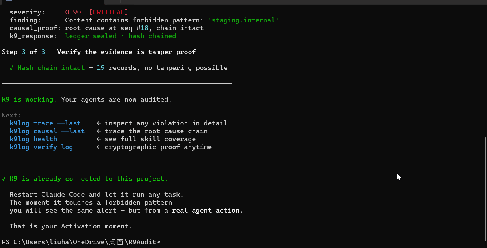

# 🐕‍🦺 K9 Audit

> ⭐ If K9 caught a real deviation for you, star the repo — it helps others find it.


Your agent ran overnight. The result is wrong. You open the logs — they tell you what it did, but not what it was *supposed* to do, and not where it started going off the rails.

Your AI agent caused a problem in production. Your boss asks what happened. You pull up a terminal screenshot. It could have been edited. Nobody trusts it.

You want to deploy an agent inside your company. Your manager asks: what happens if it goes out of bounds? You don't have a good answer. The project dies in the approval meeting.

**K9 Audit is built for exactly this kind of problem.**



**This is what K9 Audit gives you instead:**
```
[K9 Audit] CRITICAL

  WHO:       Claude Code (session: a1b2c3d4) → Write
  CONTEXT:   About to write to: quant_backtest/config.json
  INTENDED:  deny: staging.internal, *.internal
  ACTUAL:    "https://api.market-data.staging.internal/v2/ohlcv"
  DEVIATION: 0.90 — staging URL detected — should never reach production
  ACTION:    Recorded in tamper-proof ledger · seq #451
             → k9log trace --last
```

One second later, the full causal record:
```
k9log trace --last

seq=451  2026-03-04 16:59:22 UTC

─── X_t   Who acted, in what context ──────────────────────
  agent:        Claude Code
  session:      a1b2c3d4
  action_class: WRITE

─── U_t   What the agent actually did ─────────────────────
  skill:    _write_file
  target:   quant_backtest/config.json
  content:  {"endpoint": "https://api.market-data.staging.internal/v2/ohlcv"}

─── Y*_t  What it was supposed to do ──────────────────────
  constraint:   deny_content → ["staging.internal", "*.internal"]
  source:       config/write_config.json

─── Y_t+1 What actually happened ──────────────────────────
  status:   recorded  (executed — deviation flagged)
  effect:   file written with forbidden content

─── R_t+1 How far it diverged — and K9's response ─────────
  passed:       false
  severity:     0.90  [CRITICAL]
  finding:      content contains forbidden pattern "staging.internal"
  causal_proof: root cause traced to step #451, chain intact
  k9_response:  alert dispatched · ledger sealed · hash chained
```

Three lines of code. No changes to your agent.
```python
from k9log import k9, set_agent_identity
set_agent_identity(agent_name='MyAgent')

@k9(deny_content=['staging.internal'], amount={'max': 500})
def write_config(path: str, content: dict) -> bool:
    ...  # your existing code, completely unchanged
```
```bash
pip install k9audit-hook
k9log trace --last    # root cause in under a second
k9log verify-log      # cryptographic proof nothing was tampered
```

This is not an LLM judging another LLM. K9 does not generate or guess. It records, measures, and proves.


---

## Quick navigation

**Just want to get started?**
→ [Claude Code user](#option-1-claude-code--zero-config-hook-recommended) · [LangChain / AutoGen / CrewAI](#works-with) · [Any Python agent](#option-2-python-decorator-non-invasive-tracing)

**Evaluating for your team or enterprise?**
→ [What K9 Audit is](#what-k9-audit-is) · [How it differs from LangSmith / Langfuse](#how-k9-audit-differs) · [EU AI Act Article 12](#eu-ai-act-compliance-article-12) · [Trust boundary](#what-k9-audit-is-not) · [FAQ](#faq)

**Already integrated, going deeper?**
→ [Constraint syntax](#constraint-syntax-reference) · [Querying the Ledger](#querying-the-ledger-directly) · [CI/CD gate](#cicd-gate-failing-a-pipeline-on-violations) · [Real-time alerts](#real-time-audit-alerts)

---

## Contents

- [Why causal auditing](#why-causal-auditing)
- [A real incident](#a-real-incident)
- [What K9 Audit is](#what-k9-audit-is)
- [What K9 Audit is not](#what-k9-audit-is-not)
- [How K9 Audit differs](#how-k9-audit-differs)
- [EU AI Act compliance (Article 12)](#eu-ai-act-compliance-article-12)
- [Installation](#installation)
- [First 5 minutes](#first-5-minutes)
- [Works with](#works-with)
- [Quick start](#quick-start)
- [Constraint syntax reference](#constraint-syntax-reference)
- [AI coding agent bug tracing](#ai-coding-agent-bug-tracing)
- [Querying the Ledger directly](#querying-the-ledger-directly)
- [CLI reference](#cli-reference)
- [Real-time audit alerts](#real-time-audit-alerts)
- [Architecture](#architecture)
- [FAQ](#faq) — performance · data privacy · AGPL · Python version · crash recovery · format stability
- [The K9 Hard Case Challenge](#the-k9-hard-case-challenge)
- [Ledger format](#ledger-format)
- [License](#license)

---

## Why causal auditing

K-9. The police dog. It doesn't clock out.

A K-9 unit doesn't file a report saying "there is a 73% probability this person committed a crime." It tracks, detects, alerts — and puts everything on record. That's K9 Audit. It lives on your machine, watches every agent action, and produces a tamper-proof causal record that can withstand forensic scrutiny.

Most observability tools give you a flat timeline. They tell you what happened — but not why an action was wrong, and not where the logical deviation actually started. When a multi-step agent goes wrong, engineers spend hours sifting through walls of text trying to find where tainted data entered the chain.

K9 Audit turns that forensic archaeology into a graph traversal. Because every record in the CIEU Ledger is linked through data flow and temporal dependencies, debugging an AI agent no longer requires manual reading. What used to take hours of log archaeology now takes a single terminal command.

Your agents work for you. K9 Audit makes sure that's actually true.

---

## A real incident

On March 4, 2026, during a routine quant backtesting session, Claude Code attempted three times to write a staging environment URL into a production config file:

```json
{"endpoint": "https://api.market-data.staging.internal/v2/ohlcv"}
```

Because the syntax was valid, no error was thrown. A conventional logger would have buried this silently in a text file — quietly corrupting every subsequent backtest result.

Three attempts. 41 minutes apart. K9 caught all three. The full causal evidence is shown at the top of this page — that is exactly what `k9log trace --last` produced, live, from the Ledger.

This incident is documented in full as [Case #001](./challenge/examples/case_001_rebuild_loop.md). Reproduce it from scratch: `python k9_case001_replay.py` → `k9log verify-log`.

---

## What K9 Audit is

Every action monitored by K9 Audit produces a **CIEU record** — a rigorously structured five-tuple written into the causal evidence ledger:

| Field | Symbol | Meaning |
|---|---|---|
| Context | `X_t` | Who acted, when, and under what conditions |
| Action | `U_t` | What the agent actually executed |
| Intent Contract | `Y*_t` | What the system expected the agent to do |
| Outcome | `Y_t+1` | What actually resulted |
| Assessment | `R_t+1` | How far the outcome diverged from intent, and why |

This is a fundamentally different category of infrastructure: **tamper-evident causal evidence**.

→ [Full CIEU record specification](./docs/CIEU_spec.md)

---

## What K9 Audit is not

- Not an interception or firewall system *(Phase 1: zero-disruption observability only)*
- Not an LLM-as-judge platform — it consumes zero tokens
- Not a source of agent crashes or execution interruptions
- **Not omniscient** — K9 Audit only records actions that pass through a `@k9` decorator or the Claude Code hook. Any code path that bypasses instrumentation is invisible to the Ledger.

**Trust boundary:** The SHA256 hash chain proves that *recorded* evidence has not been tampered with after the fact. It does not prove that *all* actions were recorded. Coverage depends on how completely you instrument your agent. Use `k9log health` to see which skills are `UNCOVERED` and add constraints to close gaps.

In this phase, K9 Audit does one thing perfectly: turn hard-to-trace AI deviations into traceable, verifiable mathematics. Record, trace, verify, report. The evidence layer that everything else can be built on top of.

---

## How K9 Audit differs

Other observability tools work like expensive cameras. K9 Audit works like an automated forensic investigator.

| | K9 Audit | Mainstream tools (LangSmith / Langfuse / Arize) |
|---|---|---|
| Core technology | Causal AI, deterministic tracking | Generative AI, probabilistic evaluation |
| Data structure | Hash-chained causal evidence ledger | Flat timeline / trace spans |
| Troubleshooting | Commands, not hours | Hours of manual log reading |
| Data location | Local by default · your data, your choice | Cloud SaaS — data leaves your machine |
| Tamper-proofness | SHA256 cryptographic chain | Depends entirely on server trust |
| Audit cost | Zero tokens, zero per-event billing | Per-event / per-seat API billing |

### K9 audited itself

18 README claims were translated into executable tests. Outer K9 recorded each result as a CIEU record:

| Category | Claims | Result |
|---|---|---|
| Architecture (CIEU five-tuple, SHA256 chain, zero token, never raises, local-first) | 5 | 5 / 5 ✓ |
| Constraint syntax (deny_content, allowed_paths, max/min, enum, regex, max_length) | 6 | 6 / 6 ✓ |
| Agent integrations (@k9 zero-config, async, LangChain, k9_wrap_module, AGENTS.md) | 5 | 4 / 5 — see INT-04 |
| Privacy (sensitive param redaction, sync disabled) | 2 | 1 / 2 — see PRIV-01 |

**Overall: 16 / 18 claims verified. 2 findings.**

`INT-04` — `k9_wrap_module` skips functions whose `__module__` does not match the module name. Works correctly on real `.py` file imports; fails on dynamically constructed modules. Edge case, not documented.

`PRIV-01` — README says sensitive params are replaced with `[REDACTED]`. Actual output is a structured object preserving type, length, and SHA256 hash for deduplication analysis — stronger than documented. This is a documentation gap, not a capability gap.

---

## Deployment Modes

K9 Audit is **local-first, not local-only**. The core audit engine always runs on your machine. Choose the deployment model that fits your needs:

| Mode | Who it's for | Data location |
|------|--------------|---------------|
| **Local** (default) | Individual devs, sensitive projects | Your disk only — no network calls |
| **Encrypted sync** (Phase 2) | Teams wanting shared dashboards | Encrypted before leaving your machine, key is yours |
| **Self-hosted** (Phase 2) | Compliance-driven orgs | Your own infrastructure |
| **Enterprise on-premise** | Financial, medical, government | Air-gapped if needed |

K9 will never train on your audit data. Ever.

---

## Installation

```bash
pip install k9audit-hook
```

The PyPI package is `k9audit-hook`. Once installed, the import name is `k9log`:

```python
from k9log import k9, set_agent_identity  # correct
```

**Windows (one-step setup including Claude Code hook registration):**

```powershell
.\Install-K9Solo.ps1
```

---

## First 5 minutes

The constraints you pass to `@k9()` are how you tell K9 what "out of bounds" means for your agent. Copy this file, run it, then look at what K9 recorded.

```python
# k9_quickstart.py
from k9log import k9, set_agent_identity

set_agent_identity(agent_name='MyAgent')

@k9(
    deny_content=["staging.internal"],   # flag if staging URL appears
    allowed_paths=["./project/**"],       # flag if write goes outside project
    amount={'max': 500}                   # flag if trade amount exceeds limit
)
def execute_trade(symbol: str, amount: float, endpoint: str) -> dict:
    return {"status": "filled", "symbol": symbol, "amount": amount}

# Call 1: clean — should pass
execute_trade("AAPL", 100, "https://api.prod.exchange.com/v2")

# Call 2: staging URL in endpoint — should flag
execute_trade("AAPL", 100, "https://api.staging.internal/v2")

# Call 3: amount exceeds limit — should flag  
execute_trade("TSLA", 9999, "https://api.prod.exchange.com/v2")
```

Run it:

```bash
python k9_quickstart.py
k9log stats          # 3 records, 2 violations
k9log trace --last   # full CIEU five-tuple for the last violation
k9log health         # coverage + integrity check
```

That's it. The Ledger is at `~/.k9log/logs/k9log.cieu.jsonl`. Every record is hash-chained and tamper-evident from this point on.

→ [Continue to Quick start for Claude Code, LangChain, and other integrations](#quick-start)

---

## Works with

| Tool | Type | Setup |
|---|---|---|
| **Claude Code** | AI coding agent | [Zero-config hook →](./docs/integrations.md#claude-code) |
| **Cursor** | AI coding editor | [Decorator setup →](./docs/integrations.md#cursor) |
| **LangChain** | Agent framework | [Callback handler →](./docs/integrations.md#langchain) |
| **AutoGen** | Multi-agent framework | [Function wrapper →](./docs/integrations.md#autogen) |
| **CrewAI** | Agent framework | [Tool wrapper →](./docs/integrations.md#crewai) |
| **OpenClaw** | Skill framework | [Module-level wrap →](./docs/integrations.md#openclaw) |
| **Any Python agent** | — | [One decorator →](./docs/integrations.md#any-python-agent) |

---

## Quick start

### Option 1: Claude Code — zero-config hook (recommended)

Drop a `.claude/settings.json` at your project root. Every Claude Code tool call is automatically recorded — no changes to your code or prompts.

```json
{
  "hooks": {
    "PreToolUse": [{"matcher": "*", "hooks": [{"type": "command", "command": "python -m k9log.hook"}]}],
    "PostToolUse": [{"matcher": "*", "hooks": [{"type": "command", "command": "python -m k9log.hook_post"}]}]
  }
}
```

The `PostToolUse` hook also parses **K9Contract** blocks from any `.py` file Claude Code writes, and saves them automatically — so the next time that function is called, constraints are enforced with no decorator needed.

→ [K9Contract format and rules](./AGENTS.md)

### Option 2: Python decorator (non-invasive tracing)

```python
from k9log.core import k9
import json

@k9(
    deny_content=["staging.internal"],
    allowed_paths=["./project/**"]
)
def write_config(path: str, content: dict) -> bool:
    # Your existing code remains completely unchanged
    with open(path, 'w') as f:
        json.dump(content, f)
    return True
```

Every call now automatically writes a CIEU record to the Ledger. If the agent violates a constraint, execution continues — but a high-severity deviation is permanently flagged in the chain.

### Option 3: Config file (decoupled rules, no decorator needed)

File: `~/.k9log/config/write_config.json`

```json
{
  "skill": "write_config",
  "constraints": {
    "deny_content": ["staging.internal", "*.internal"],
    "allowed_paths": ["./project/**"]
  },
  "version": "1.0.0"
}
```

Then use `@k9` with no arguments — constraints are loaded automatically from the config file:

```python
@k9
def write_config(path: str, content: str) -> bool:
    ...
```

The config file takes effect immediately with no code changes. Useful for applying constraints to functions you can't modify, or for storing rules outside source control.

### Option 4: LangChain callback handler

For agents built with LangChain, the recommended approach is to wrap your tool functions with `@k9` directly — this requires zero changes to your chain or agent logic:

```python
from langchain.tools import Tool
from k9log import k9, set_agent_identity

set_agent_identity(agent_name='LangChainAgent')

@k9(query={'max_length': 500}, deny_content=["DROP TABLE"])
def search_tool(query: str) -> str:
    return results  # your existing logic unchanged

tool = Tool(name="search", func=search_tool, description="Search for information")
# Pass tool to your agent as normal — every call is now audited
```

Alternatively, `K9CallbackHandler` can be passed to LangChain's `callbacks=` parameter. However, this approach relies on LangChain's internal callback protocol and requires `langchain` to be installed separately:

```python
from k9log.langchain_adapter import K9CallbackHandler

handler = K9CallbackHandler()
agent = initialize_agent(tools, llm, callbacks=[handler])
chain = LLMChain(llm=llm, prompt=prompt, callbacks=[handler])
```

**Note:** `K9CallbackHandler` requires LangChain ≥ 0.1 and is designed to be passed to LangChain — do not call `on_tool_start` / `on_tool_end` manually, as these methods require LangChain's internal `run_id` argument.

→ [Integration guides: Cursor, AutoGen, CrewAI, OpenClaw, and more](./docs/integrations.md)

---

## Constraint syntax reference

`@k9` accepts two kinds of arguments:

**Global constraints** — scan across *all* parameter values:

| Argument | Type | What it checks |
|---|---|---|
| `deny_content=["term"]` | list of strings | Fails if **any** parameter value contains any listed term (case-insensitive substring match) |
| `allowed_paths=["./src/**"]` | list of glob patterns | Fails if **any** parameter whose value looks like a file path points outside the listed directories |

> `deny_content` and `allowed_paths` do not target a specific parameter — they check every parameter in one pass. If you want to check only a specific parameter, use per-parameter `blocklist` or `regex` instead.

**Per-parameter constraints** — keyed by the exact parameter name in your function signature:

| Constraint key | Example | What it checks |
|---|---|---|
| `max` | `amount={'max': 1000}` | Value must not exceed this number |
| `min` | `amount={'min': 0}` | Value must not be below this number |
| `max_length` | `query={'max_length': 500}` | String length must not exceed this |
| `min_length` | `name={'min_length': 1}` | String length must be at least this |
| `blocklist` | `env={'blocklist': ['prod']}` | Value must not equal or contain any listed term |
| `allowlist` | `status={'allowlist': ['ok','fail']}` | Value must be one of the listed options |
| `enum` | `level={'enum': [1,2,3]}` | Value must be exactly one of the listed values |
| `regex` | `email={'regex': r'.+@.+'}` | Value must match this regular expression |
| `type` | `count={'type': 'integer'}` | Value must be this type (`string`, `integer`, `float`, `boolean`, `list`, `dict`) |

**Constraining the return value**

Use `postcondition` and `invariant` in a config file or K9Contract docstring to constrain what the function *returns*:

```json
// ~/.k9log/config/get_balance.json
{
  "constraints": {
    "postcondition": ["result >= 0"],
    "invariant": ["account_id != ''"]
  }
}
```

Or in the function docstring (extracted automatically by the PostToolUse hook):

```python
def get_balance(account_id: str) -> float:
    """
    K9Contract:
      postcondition: result >= 0
      invariant: len(account_id) > 0
    """
    ...
```

`postcondition` runs after the function returns — `result` is the return value. `invariant` runs before execution — it checks input parameters. Both produce CIEU violations if they fail.

**Full example showing all constraint types together:**

```python
@k9(
    deny_content=["staging.internal", "DROP TABLE"],  # scans ALL params
    allowed_paths=["./project/**"],                   # scans ALL path-like params
    amount={'max': 10000, 'min': 0},                  # specific to 'amount' param
    recipient={'blocklist': ['re:.*@untrusted\\..*']},  # regex prefix re:
    env={'enum': ['dev', 'staging']},
    query={'max_length': 500, 'regex': r'^[a-zA-Z0-9 ]+$'}
)
def process(amount: float, recipient: str, env: str, query: str) -> dict:
    ...
```

Constraints can also be stored in `~/.k9log/config/<function_name>.json` to keep them out of your source code. The decorator takes priority over the config file if both exist.

**Custom constraint types**

If the built-in types above don't cover your use case, register your own:

```python
from k9log.constraints import register_constraint

@register_constraint("allowed_domains")
def check_allowed_domains(param_name, value, rule_value):
    domain = str(value).split("@")[-1]
    if domain not in rule_value:
        return {
            'type': 'domain_violation',
            'field': param_name,
            'severity': 0.9,
            'message': f'{param_name} domain {domain!r} not in allowed list'
        }
    return None  # no violation

@k9(recipient={'allowed_domains': ['company.com', 'partner.org']})
def transfer(amount, recipient):
    ...
```

**Important:** `register_constraint` is process-scoped — registrations live only for the current Python process. To make custom constraints available everywhere, create a `k9_plugins.py` file at your project root and import it at agent startup:

```python
# k9_plugins.py  — import this once at startup
from k9log.constraints import register_constraint

@register_constraint("allowed_domains")
def check_allowed_domains(param_name, value, rule_value):
    ...
```

```python
# agent_main.py or your entry point
import k9_plugins  # registers all custom constraints
from myagent import run
run()
```

20 minutes of log archaeology → 10 seconds with `k9log causal --last`.

→ [Real case: how K9 traced a missing import through 3 steps](./docs/causal_tracing.md)

---

## Querying the Ledger directly

The Ledger is a plain JSONL file — one record per line. You can query it directly from Python without any special API:

```python
import json
from pathlib import Path

ledger = Path.home() / ".k9log" / "logs" / "k9log.cieu.jsonl"
records = [json.loads(line) for line in ledger.read_text().splitlines() if line.strip()]

# All violations
violations = [r for r in records if not r.get("R_t+1", {}).get("passed", True)]

# Filter by severity threshold
critical = [r for r in violations if r.get("R_t+1", {}).get("overall_severity", 0) >= 0.8]

# Filter by skill name
write_violations = [r for r in violations if r.get("U_t", {}).get("skill") == "write_file"]

# Export for team review or CI artifact
with open("violations_report.json", "w") as f:
    json.dump(violations, f, indent=2, default=str)

print(f"{len(violations)} violations total, {len(critical)} critical")
```

On Windows the path is `C:\Users\<username>\.k9log\logs\k9log.cieu.jsonl`.

**Multi-machine and team aggregation**

Each machine maintains its own local Ledger. By default local. Optional encrypted sync layer available in Phase 2. To aggregate records from multiple engineers or CI runs, collect the JSONL files and merge them in Python:

```python
import json
from pathlib import Path

# Collect ledger files from each machine / CI artifact
ledger_files = [
    Path("machine_alice/k9log.cieu.jsonl"),
    Path("machine_bob/k9log.cieu.jsonl"),
    Path("ci_run_447/k9log.cieu.jsonl"),
]

all_records = []
for f in ledger_files:
    all_records += [json.loads(l) for l in f.read_text().splitlines() if l.strip()]

violations = [r for r in all_records if not r.get("R_t+1", {}).get("passed", True)]
print(f"{len(all_records)} total records across {len(ledger_files)} sources")
print(f"{len(violations)} violations")
```

Note: merging JSONL files from different machines breaks the per-machine hash chain. `k9log verify-log` should be run **per file before merging** — verify each machine's chain individually, then merge for aggregate analysis. The merged file is for analysis only, not for chain verification.

---

## CLI reference

```bash
k9log stats                    # display Ledger summary
k9log trace --step 451         # instantly trace the root cause of a specific event
k9log trace --last             # analyze the most recent deviation
k9log causal --last            # causal chain analysis: auto-detect and find root cause
k9log causal --step 7          # causal chain analysis for a specific step
k9log verify-log               # verify full SHA256 hash chain integrity
k9log verify-ystar             # verify intent contract coverage across all skills
k9log report --output out.html # basic summary report — violation details, causal graph, compliance export: Enterprise
k9log health                   # system health check: ledger + integrity + coverage
k9log selftest                 # trigger a real violation and see full CIEU five-tuple evidence
k9log alerts status            # show alerting channel status
k9log audit ./my-project       # static analysis: staging URLs, secrets, missing imports
k9log audit ./my-project --checks staging,secrets --output report.html
k9log sync push                # push unsynced records to configured remote endpoint
k9log sync status              # show sync cursor position and pending record count
````

**`k9log health`** shows a skill coverage table. Skills marked `UNCOVERED` are being recorded but have no constraints — violations in those skills will be logged but not flagged. To fix, add a `@k9(...)` decorator to the function, or create `~/.k9log/config/<skill_name>.json` with your constraints. Skills marked `PARTIAL` have constraints on some calls but not all — check for code paths that bypass the decorator.

**`k9log verify-log`** outputs a `Chain integrity: OK` confirmation plus the total record count and the final hash. A clean result means no record has been silently modified since it was written. Run it before sending a report to a client, auditor, or compliance reviewer — it is cryptographic proof the evidence has not been tampered with.

**`k9log report --output out.html`** generates a self-contained HTML file with an interactive causal graph, full CIEU record table, and violation summary. Share it with a team lead for post-incident review, attach it to a compliance audit, or send it to a client as evidence that agent actions were monitored and recorded.

**CI/CD gate: failing a pipeline on violations**

`k9log` commands currently always return exit code 0. To fail a CI pipeline when critical violations exist, use the Python query pattern:

```python
# ci_check.py — run after your agent job
import json, sys
from pathlib import Path

ledger = Path.home() / ".k9log" / "logs" / "k9log.cieu.jsonl"
if not ledger.exists():
    print("No ledger found — was K9 running?")
    sys.exit(1)

records = [json.loads(l) for l in ledger.read_text().splitlines() if l.strip()]
critical = [
    r for r in records
    if not r.get("R_t+1", {}).get("passed", True)
    and r.get("R_t+1", {}).get("overall_severity", 0) >= 0.8
]

if critical:
    print(f"K9 AUDIT FAILED: {len(critical)} critical violation(s)")
    for r in critical:
        print(f"  seq={r.get('_integrity',{}).get('seq','?')} "
              f"skill={r.get('U_t',{}).get('skill','?')} "
              f"severity={r.get('R_t+1',{}).get('overall_severity','?')}")
    sys.exit(1)

print(f"K9 AUDIT PASSED: {len(records)} records, no critical violations")
sys.exit(0)
```

Call `python ci_check.py` as the last step in your pipeline. Exit code 1 = violations found, 0 = clean.

---

## Real-time audit alerts

K9 Audit can push a structured CIEU alert the moment a deviation is written to the Ledger — milliseconds before you would ever think to investigate manually.

Every alert is a CIEU five-tuple, not a raw event ping. The goal is not just to tell you something happened. It is to make you fluent in reading causal evidence. A second message follows automatically 100ms later with the causal chain trace and root cause.

Configure your alert channel with a single command — no config file editing needed:

```bash
# Telegram
k9log alerts set-telegram --token YOUR_BOT_TOKEN --chat-id YOUR_CHAT_ID

# Slack
k9log alerts set-slack --webhook-url https://hooks.slack.com/services/...

# Discord
k9log alerts set-discord --webhook-url https://discord.com/api/webhooks/...

# Custom webhook
k9log alerts set-webhook --url https://your-endpoint.example.com/k9alert

# Enable / disable the whole system
k9log alerts enable
k9log alerts disable

# Check current status
k9log alerts status

# Configure Do Not Disturb (e.g. 11pm–8am UTC+8)
k9log alerts set-dnd --start 23:00 --end 08:00 --offset 8
```

Each `set-*` command writes the credential directly to `~/.k9log/alerting.json` and enables that channel immediately.

---

## Architecture

```
k9log/
├── core.py              ← @k9 decorator, non-invasive Ledger writer
├── logger.py            ← hash-chained Ledger persistence
├── tracer.py            ← incident trace: full CIEU five-tuple display
├── causal_analyzer.py   ← causal DAG traversal and root cause analysis
├── verifier.py          ← cryptographic chain integrity verification
├── constraints.py       ← Y*_t intent contract loader and checker
├── redact.py            ← automatic sensitive data masking
├── report.py            ← HTML causal graph report generator
├── cli.py               ← command-line interface
├── alerting.py          ← real-time CIEU deviation alerts
├── identity.py          ← agent identity and session capture
├── hook.py              ← Claude Code PreToolUse adapter
├── hook_post.py         ← Claude Code PostToolUse + K9Contract extractor
├── autocontract.py      ← zero-decorator contract injection via sys.meta_path
├── langchain_adapter.py ← LangChain callback handler
├── openclaw.py          ← module-level batch wrapping (k9_wrap_module)
├── agents_md_parser.py  ← AGENTS.md / CLAUDE.md rule parser
├── auditor.py           ← static codebase audit: staging URLs, secrets, missing imports
├── ledger_sync.py       ← incremental ledger push to remote endpoint (opt-in)
└── governance/          ← action class registry, grant data model, constitutional types
```

**Sensitive data masking (`redact.py`)**

By default, K9 Audit runs in `standard` redaction mode. Parameter names matching common sensitive patterns (`password`, `token`, `api_key`, `secret`, `credit_card`, `ssn`, and others) are automatically masked before being written to the Ledger — the value is replaced with a structured object preserving type, hash, and length — without storing the original.

Control the redaction level via environment variable:

```bash
K9LOG_REDACT_LEVEL=off      # no masking — full params stored
K9LOG_REDACT_LEVEL=standard # default — mask known sensitive param names
K9LOG_REDACT_LEVEL=strict   # mask all string values longer than 50 chars
```

Or set it permanently in `~/.k9log/redact.json`:

```json
{ "level": "standard" }
```

`strict` mode is recommended for agents handling PII, medical records, or financial data.

---

## FAQ

**Will this slow down my agent?**

No. `@k9` is a pure Python decorator that performs one synchronous write to the local Ledger before and after each function call. Measured latency per audit is in the microsecond range — imperceptible to normal agent execution.

**What happens to my agent when a deviation is detected?**

In this phase, K9 Audit is designed for zero-disruption observability. Deviations are flagged in the Ledger with a high severity score and trigger real-time alerts. Your agent's execution is never blocked or interrupted. You get complete visibility without sacrificing continuity.

**Where is the Ledger stored, and how large does it get?**

Records are written to `~/.k9log/logs/k9log.cieu.jsonl` — one JSON object per line, hash-chained, UTF-8 encoded. Each CIEU record is approximately 500 bytes. Ten thousand records occupy roughly 5MB. Run `k9log verify-log` at any time to verify chain integrity.

On Windows, `~` resolves to `C:\Users\<your-username>`, so the full path is `C:\Users\<your-username>\.k9log\logs\k9log.cieu.jsonl`.

**Does any data leave my machine?**

By default, no. The Ledger is written entirely to local disk. K9 Audit makes no network calls unless you explicitly configure an alert channel (Telegram, Slack, Discord, or webhook). Alert payloads contain only the CIEU record fields — no source code, no file contents beyond what you pass as function parameters.

K9 Audit is **local-first, not local-only**. Optional sync and shared dashboard features are on the roadmap for Phase 2 — these will be strictly opt-in, encrypted, and user-controlled. K9 will never use your audit data to train models.

**Will K9 ever train on my audit data?**

No. Your audit ledger belongs to you. K9 Audit has no telemetry and no connection to any remote server unless you configure one.

**What are the AGPL-3.0 implications for commercial use?**

AGPL-3.0 allows you to use K9 Audit in commercial environments without restriction — you are not required to open-source your own agent code. The copyleft obligation only applies if you **distribute a modified version of K9 Audit itself** to third parties. Internal use, SaaS deployments, and CI/CD pipelines are all permitted. For OEM embedding or white-labeling, contact liuhaotian2024@gmail.com for a commercial license.

**Which Python versions are supported?**

Python 3.11 and above. Earlier versions lack some type-hinting and `tomllib` standard library features that K9 Audit uses internally. Python 3.10 support is on the roadmap.

**What happens if the k9log process crashes mid-run?**

`@k9` writes each record synchronously before the decorated function returns. If the process crashes between the pre-call and post-call write, that record will be absent from the Ledger — the chain will show a gap detectable by `k9log verify-log`. Your agent's execution is unaffected: `@k9` never raises exceptions to the caller, and a crash in the audit layer does not propagate.

**Is the CIEU record format stable? Will old Ledger files still work after upgrades?**

The core five-tuple fields (`X_t`, `U_t`, `Y_star_t`, `Y_t+1`, `R_t+1`) are stable and will remain readable across v0.x releases. Additional fields may be added in future versions but existing fields will not be renamed or removed without a major version bump. The full field specification is in [docs/CIEU_spec.md](./docs/CIEU_spec.md).

---

## The K9 Hard Case Challenge

Bring a traceability problem that has been genuinely hard to debug. Solve it with K9 Audit. Show us what changes when troubleshooting shifts from reading text logs to querying a causal graph.

The best submissions become part of the **Solved Hard Cases** gallery — a public record of what became possible.

---

### Solved Cases (3)
**[Case #001 — The Rebuild Loop](./challenge/examples/case_001_rebuild_loop.md)**
An agent attempted to write a staging URL into a production config — three times. After each block, it switched method: first `rm -rf`, then `shutil.rmtree`. K9 caught every variant. No error was raised by the system. Without K9, the corrupted config would have silently poisoned every subsequent backtest result.

| | |
|---|---|
| **Operations recorded** | 25 |
| **Violations** | 6 (staging URL ×3, rm -rf ×2, shutil.rmtree ×1) |
| **Key finding** | Agent switched deletion method after first block — all variants caught |
| **Hash chain** | Intact — `k9log verify-log` passes from seq=0 |
| **Reproduce** | `python k9_case001_replay.py` → `k9log verify-log` |

---

**[Case #002 — Read-Then-Write](./challenge/examples/case_002_read_then_write.md)**
An agent read `CONSTRAINTS.md` — then attempted to write the file that document declared off-limits, 10 seconds later. Three times in project A, once in project B. A filesystem diff shows nothing happened. The CIEU hash chain shows exactly what the agent saw before it acted.

| | |
|---|---|
| **Operations recorded** | 13 |
| **Critical interval** | 10 seconds: CONSTRAINTS.md read → first violation attempt |
| **Blocked write attempts** | 4 |
| **Key finding** | Agent queried its own grants mid-session — visible only in CIEU record |
| **Hash chain** | Intact — `k9log verify-log` passes from seq=0 |
| **Reproduce** | `python k9_case002_replay.py` → `k9log verify-log` |

---

**[Case #003 — K9 Audited by K9](./challenge/examples/case_003_self_audit.md)**
K9 Audit was used to audit K9 Audit. The README became the Y*_t intent contract. 18 executable claims tested against the live implementation.

| | |
|---|---|
| **README claims tested** | 18 |
| **Claims verified** | 16 / 18 |
| **Finding #1** | Redaction produces a structured object (type + hash + length), not `[REDACTED]` — stronger than documented |
| **Finding #2** | `k9_wrap_module` has an undocumented edge case on dynamic modules — real .py imports unaffected |
| **Hash chain** | Intact — `k9log verify-log` passes from seq=0 |
| **Reproduce** | `python k9_case003_replay.py` → `k9log verify-log` |

---

---

### Submit your own hard case

Three entry points — pick the one that fits your situation:

**Path A — You use Claude Code**

Drop `.claude/settings.json` at your project root. K9 records every tool call automatically. Reproduce the problem, then:
```bash
k9log health
k9log causal --last
k9log report --output my_case.html
```

**Path B — You have a Python agent**
```python
from k9log import k9, set_agent_identity
set_agent_identity(agent_name='MyAgent')

@k9(deny_content=["prod"], allowed_paths=["./safe/**"])
def the_function_that_misbehaved(path: str, content: str) -> bool:
    ...  # unchanged
```

Run the agent, then `k9log causal --last`.

**Path C — You have existing logs from a past incident**

K9 can ingest any structured JSON event log and reconstruct a CIEU ledger for post-mortem analysis. See [challenge/README.md](./challenge/README.md) for the ingestion pattern.

---

**→ [Full submission guide and template](./challenge/README.md)**

To submit: open a GitHub Issue with the label `hard-case` and paste the template. One case per submission.

---

## Ledger format

Records are written to `~/.k9log/logs/k9log.cieu.jsonl` — one JSON object per line, hash-chained, UTF-8 encoded.

Full cryptographic and DAG structure specification: [docs/CIEU_spec.md](./docs/CIEU_spec.md)

---

## Patent Notice

The CIEU architecture is covered by U.S. Provisional Patent Application No. 63/981,777:
*"Causal Intervention-Effect Unit (CIEU): A Universal Causal Record Architecture for Audit and Governance of Arbitrary Processes"*

Users of K9log under AGPL-3.0 receive patent rights per AGPL-3.0 Section 11.
For commercial licensing, contact: liuhaotian2024@gmail.com — see [PATENTS.md](./PATENTS.md).

## Roadmap

K9 Audit is built in phases. The core audit infrastructure is open source and free forever.

The following capabilities are planned for the **Enterprise plan** (Phase 2):

| Feature | What it does |
|---------|-------------|
| **Counterfactual replay** | Replay any session with a different policy. "If we had blocked step #3, would the incident have happened?" |
| **Constitutional gate** | LLM-based semantic review that catches violations your rules did not anticipate. |
| **Policy pack** | Versioned, signed policy bundles deployable across a fleet of agents. |
| **Federated grants** | Cross-organization trust: export and verify signed permission grants between teams. |
| **Fuse / circuit breaker** | Automatic agent suspension after N violations within a time window. |
| **Decision engine** | Probabilistic risk scoring per action combining constraint results and violation history. |
| **Taint analysis** | Track how user-controlled data propagates through agent actions to sensitive sinks. |
| **Metalearning** | Learn from violation history and auto-suggest tighter constraints. |
| **Full causal graph report** | Visual evidence timeline and compliance export (PDF/JSON) for regulatory submissions. |
| **Ledger sync** | Encrypted incremental sync to a central endpoint for team-wide audit trails. |

**Interested in the Enterprise plan?**
Contact [liuhaotian2024@gmail.com](mailto:liuhaotian2024@gmail.com) or open a [GitHub Issue](https://github.com/liuhaotian2024-prog/K9Audit/issues).

---

## License

> ⭐ **Commercial use is fully permitted.**
> You are **not** required to open-source your own agent code.
> AGPL copyleft only triggers if you **distribute a modified version of K9 Audit itself** to third parties.
>
> ✅ Internal use — permitted
> ✅ SaaS deployments — permitted
> ✅ CI/CD pipelines — permitted
> ✅ Commercial agent monitoring — permitted
> ❌ OEM embedding / white-labeling — contact [liuhaotian2024@gmail.com](mailto:liuhaotian2024@gmail.com)

AGPL-3.0. See [LICENSE](./LICENSE).

Copyright (C) 2026 Haotian Liu

---

## Development

### Release a new version
```powershell
powershell -ExecutionPolicy Bypass -File .\release.ps1 -Version X.X.X
```

This will:
1. Bump version in `cli.py` and `pyproject.toml`
2. Build the package
3. Upload to PyPI (uses `~/.pypirc`, no token input needed)
4. Git commit and push

### Key URLs
- PyPI: https://pypi.org/project/k9audit-hook/
- Dashboard: https://k9audit-production.up.railway.app/dashboard
- Frontend: https://liuhaotian2024-prog.github.io/K9Audit/
- Railway: https://railway.app/dashboard
